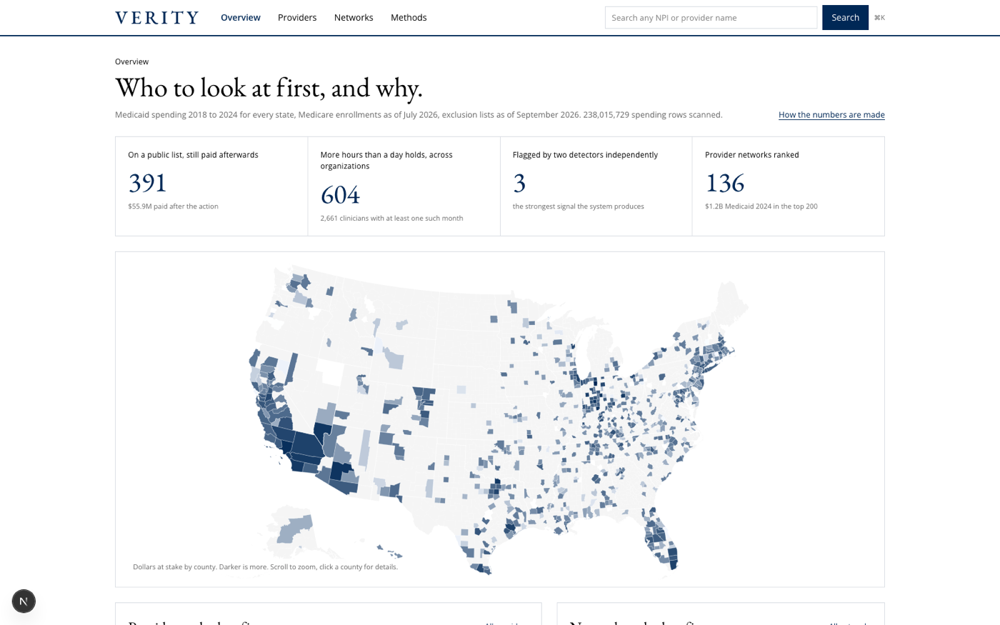
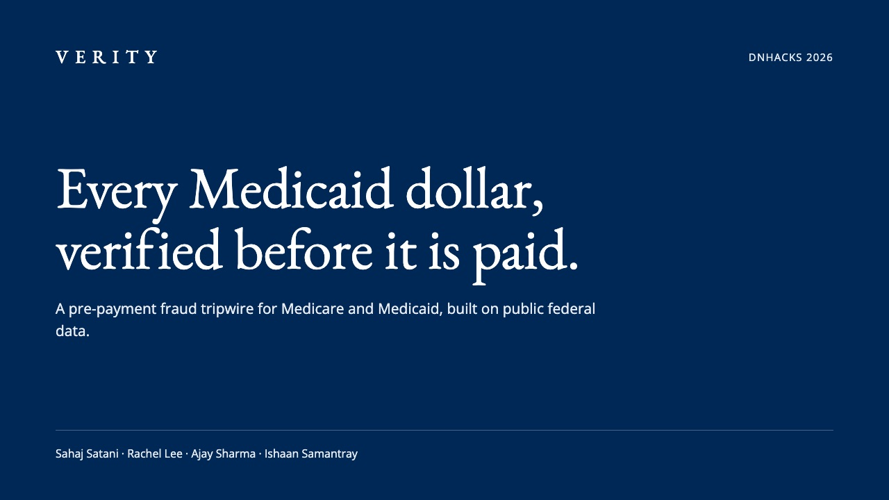
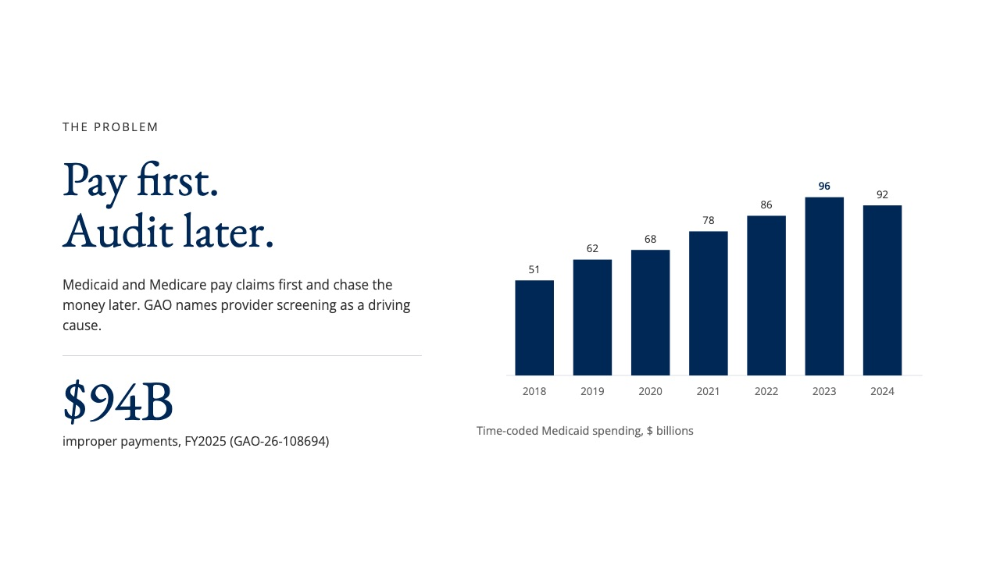
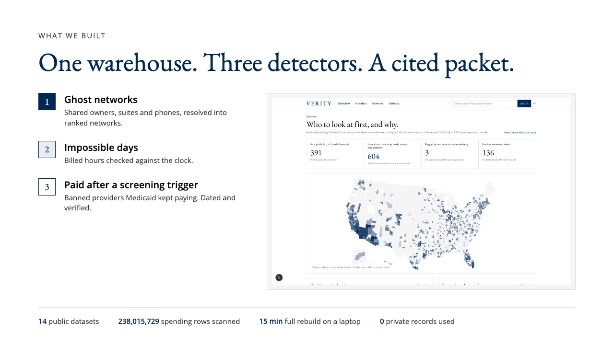
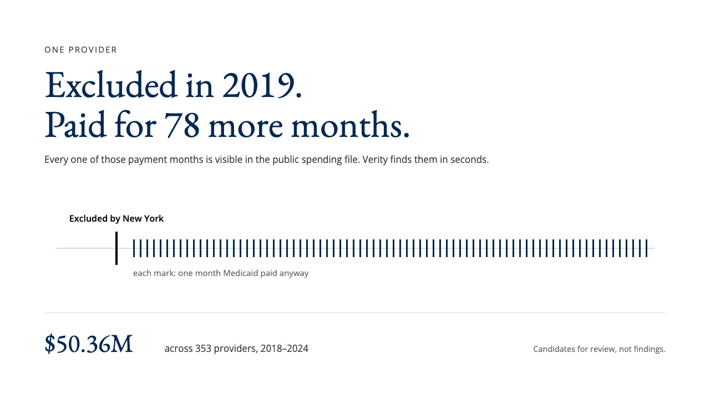
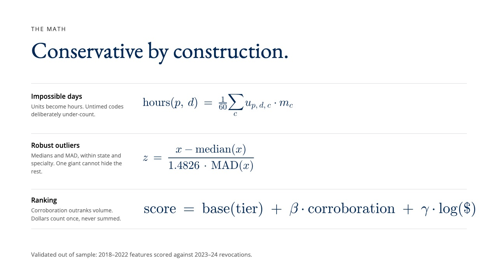
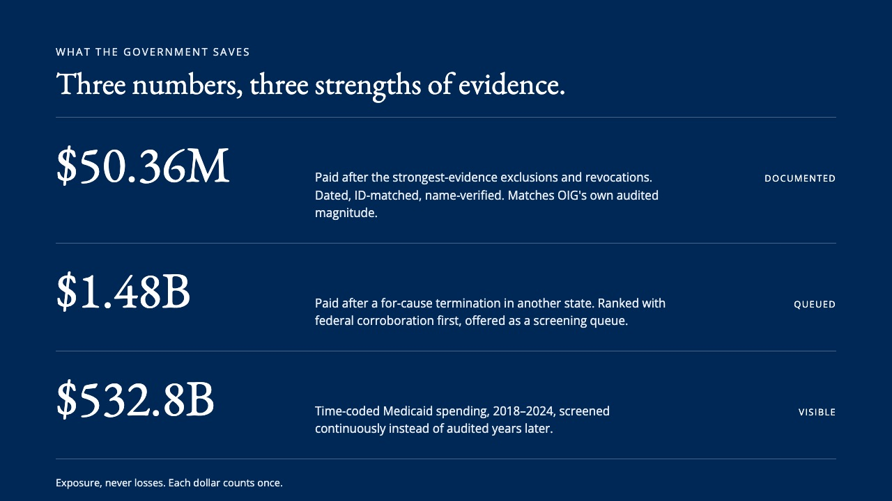
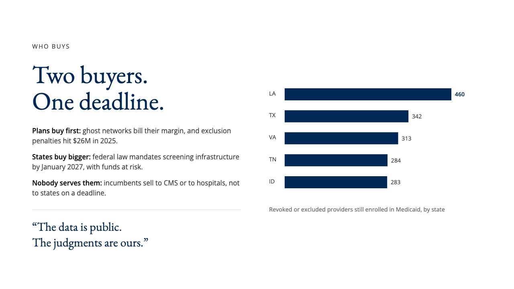
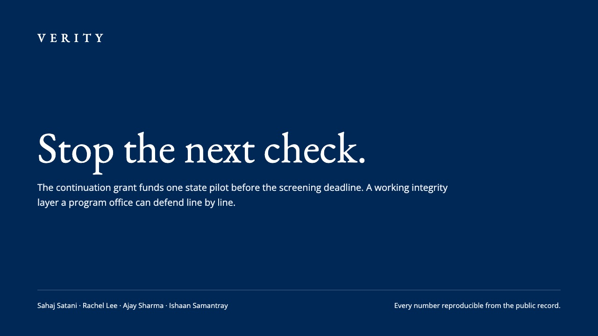
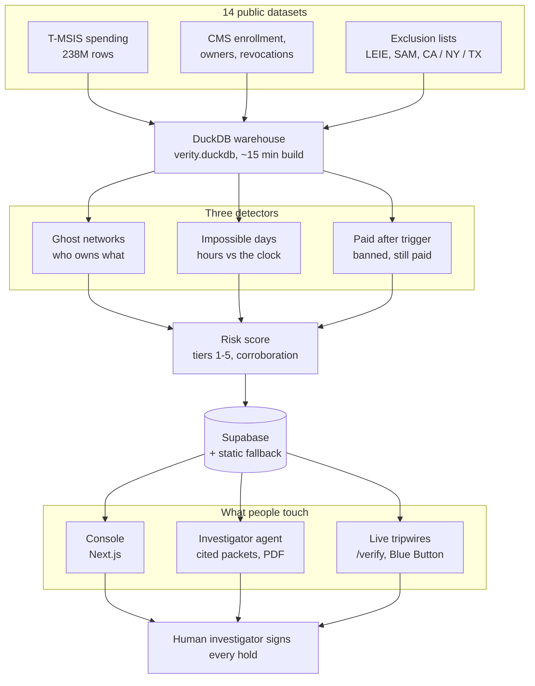

# Verity

**Every Medicaid dollar, verified before it is paid.**

A pre-payment fraud tripwire for Medicare and Medicaid, built at DNHacks 2026 entirely on public federal data. Verity joins fourteen public datasets into one warehouse, runs three independent detectors over 238 million payment rows, and hands a human investigator a ranked, cited referral packet. Every sentence in a packet points to the public record behind it.

Deep dives: [`docs/methods.md`](docs/methods.md) has every number behind the demo (regenerated by the detectors on each run), [`docs/DATA.md`](docs/DATA.md) is the data dictionary, [`docs/SUPABASE.md`](docs/SUPABASE.md) the storage wiring, [`docs/validation.md`](docs/validation.md) the ground-truth checks.



## Pitch deck

[](docs/Verity_Pitch_Deck.pdf)

Click the cover to page through the full deck as a PDF, or expand below.

<details>
<summary><b>View all eight slides</b></summary>
<br>









</details>

## The numbers

| | | |
|---|---|---|
| **238,015,729** | Medicaid payment rows scanned (T-MSIS, 2018&ndash;2024) | every state |
| **$532.8B** | time-coded Medicaid spending made searchable | screened continuously |
| **$50.36M** | paid to providers *after* their strongest-evidence exclusion or revocation | 353 providers, ID-matched, name-verified, dated |
| **2,763** | revoked or excluded providers still holding an active Medicaid enrollment | 90+ days after the action |
| **$1.48B** | paid after a for-cause termination in another state | offered as a screening queue, not a finding |

The \$50.36M figure independently matches the order of magnitude of HHS-OIG's audited finding of \$50.3M (OEI-03-19-00070). A from-scratch rebuild of this pipeline on refreshed exclusion lists reproduces it within 5%.

## Architecture



Everything statistical runs offline into plain rows. The deployed console is read-mostly, renders from committed JSON if the database is unreachable, and no automated action ever fires without a human decision recorded in the review log.

## The math

**Detector 1, ghost networks.** A heterogeneous graph over hospice, home-health and skilled-nursing enrollments: owners resolved with PECOS IDs plus a Fellegi&ndash;Sunter model fitted by EM, where agreement on field $i$ contributes the log-likelihood weight

$$w_i=\log_2\frac{m_i}{u_i},\qquad m_i=P(\text{agree}\mid\text{match}),\quad u_i=P(\text{agree}\mid\text{non-match})$$

Communities come from Leiden clustering; each network is scored on incorporation bursts, shared suites and phones, exclusion links and county saturation, composited as robust z-scores. Validation is out of sample: features from 2018&ndash;2022, scored against providers actually revoked in 2023&ndash;24, with chains held out, reported as precision at $K$.

**Detector 2, impossible days.** Time-based billing codes convert to implied hands-on hours per clinician per calendar day:

$$\text{hours}(p,d)=\frac{1}{60}\sum_{c}u_{p,d,c}\cdot m_c$$

where $u_{p,d,c}$ is units billed and $m_c$ the minutes one unit of code $c$ implies (318 codes hand-mapped in [`ingest/02_timecodes.csv`](ingest/02_timecodes.csv); untimed codes get deliberately low durations so the detector under-counts). Outliers are flagged with a robust z-score within state and taxonomy:

$$z=\frac{x-\operatorname{median}(x)}{1.4826\cdot\operatorname{MAD}(x)}$$

**Detector 3, paid after a screening trigger.** Rule-based, not statistical: an NPI appears on a federal or state "must not be paid" list with an effective date, and Medicaid shows paid claims in service months strictly after that month and before any reinstatement. Every NPI passes the check-digit test; names must agree with the national registry; weaker administrative grounds are tiered down and excluded from headlines.

**Ranking.** One row per provider:

$$\text{score}=\text{base}(\text{tier})+\beta\cdot\text{corroboration}+\gamma\cdot\log(\$)$$

A provider flagged by two detectors independently outranks any single loud signal. Dollars come from the tier-defining detector only and are never summed across detectors.

| Tier | Meaning |
|---|---|
| 1 | On a public list, and still paid afterwards |
| 2 | More hours than a day holds, across several organisations |
| 3 | Part of a suspicious network that touches a public list |
| 4 | Network structure alone, or excess hours under one organisation |
| 5 | Worth knowing, not yet a referral |

Every row is a candidate for records review, not a finding. Appeals and reinstatements are respected.

## Quickstart

```bash
python3 -m venv .venv && .venv/bin/pip install -r requirements.txt
cp .env.example .env                      # Supabase keys, ANTHROPIC_API_KEY, SAM_API_KEY
python3 scripts/download_all.py --tier all --workers 5
```

Build the warehouse and run everything (about 15 minutes on an M-series laptop once data is on disk):

```bash
.venv/bin/python ingest/00_clean_encoding.py
.venv/bin/python ingest/build_warehouse.py && .venv/bin/python ingest/03_sanity_checks.py
.venv/bin/python -c "import duckdb,re;c=duckdb.connect('data/verity.duckdb');[c.execute(s) for s in re.split(r';\s*\n', open('ingest/04_build_monthly_and_aux.sql').read()) if 'CREATE' in s]"
.venv/bin/python ingest/05_mn_rates_and_state_exclusions.py
.venv/bin/python ingest/06_sam_exclusions.py --no-fetch
.venv/bin/python detectors/d3_revoked_but_paid.py
.venv/bin/python detectors/d2_impossible_days.py
.venv/bin/python detectors/d1_ghost_networks.py
.venv/bin/python detectors/risk_score.py
.venv/bin/python ingest/sync_supabase.py && .venv/bin/python ingest/sync_outputs.py
```

Run the surfaces:

```bash
cd web && npm install && npm run dev        # http://localhost:3000, console at /app
.venv/bin/uvicorn api.main:app --port 8000  # evidence, packets, /verify, Blue Button
```

Deploy `web/` to Vercel with `NEXT_PUBLIC_SUPABASE_URL`, `NEXT_PUBLIC_SUPABASE_PUBLISHABLE_KEY`, `SUPABASE_SECRET_KEY` (server only) and, optionally, `ANTHROPIC_API_KEY` for Claude-drafted packets; without a key the packet builder is deterministic and still cites every row. [`scripts/export_static.py`](scripts/export_static.py) writes `web/public/fallback/*.json` so the console renders with no database at all.

## Beneficiary-side tripwire (Blue Button 2.0)

Any Medicare beneficiary can export their own claims from Medicare.gov and run them through the same exclusion sources as detector 3:

```bash
python3 scripts/bluebutton_offline_verify.py <bluebutton_export.json>
```

`api/bluebutton.py` implements the full authorization-code + PKCE flow against the production Blue Button API for consenting beneficiaries; the registered sandbox app is used only for CMS review, since sandbox data is synthetic. Real data only.

## Repository layout

```
ingest/       encoding clean, warehouse SQL, time-code table, state exclusion loaders, Supabase sync
detectors/    d1_ghost_networks, d2_impossible_days, d3_revoked_but_paid, risk_score
api/          FastAPI: evidence, investigator packets (Claude, deterministic fallback), /verify, Blue Button 2.0
web/          Next.js console: overview map, providers, networks, methods, search
scripts/      downloader, static export, ground-truth checks, Claude batch jobs
docs/         methods (generated), data dictionary, validation, demo script
data/         raw downloads (gitignored); manifest.json lists every file and source URL
```

## What this is not

No private data, no PII, no PHI: every input is a public federal or state file. Verity never touches a beneficiary's claim and never denies anything; it ranks providers for a human to review, and the review itself is recorded. The cross-state queue is exactly that, a queue. What the system cannot see, it says it cannot see.

## Team

Sahaj Satani &middot; Rachel Lee &middot; Ajay Sharma &middot; Ishaan Samantray

Built at DNHacks 2026, Health &amp; Public Service track, Washington, D.C.
